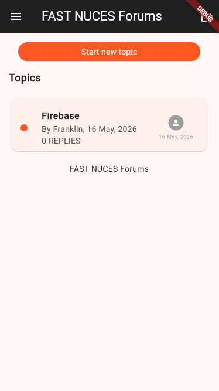
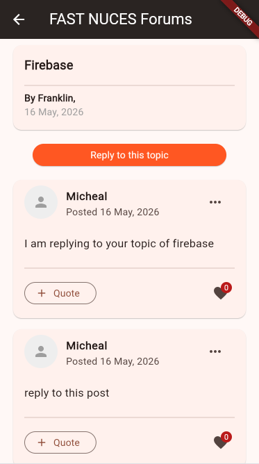

# 🎓 FAST NUCES Forums (Flutter)

A University Forums application built with Flutter and Firebase, allowing students to create discussion topics and reply to them in real time.

---

## 👨‍💻 Group Members

| Student ID | Name |
|---|---|
| 22K-4376 | Khubaib Ahmed Jamil |
| 22K-4367 | Ayan Hasan |
| 22K-4482 | Muhammad Ahmed |

---

## 🚀 Features

* 🔐 Email & Password Authentication (Sign Up / Login / Logout)
* 📋 View all forum topics in real time
* ➕ Create new forum topics
* 💬 Reply to existing topics
* 👤 Author name and timestamps shown on all posts
* ⏳ Loading indicators while fetching and posting data
* ⚠️ Validation and error handling on all inputs
* 🔄 Real-time updates from Firestore

---

## 🛠️ Tech Stack

* **Flutter** — UI Framework
* **Firebase Auth** — Email/Password Authentication
* **Cloud Firestore** — Real-time Database
* **flutter_bloc** — BloC State Management
* **Mockito** — Unit Testing with Stubs

---

## 🏗️ Architecture

This project follows **BloC Architecture** with a **separate local Firebase package**:

```
uni_forums/
├── lib/                          # Main App
│   ├── auth/
│   │   ├── bloc/                 # AuthBloc, AuthEvent, AuthState
│   │   ├── login_page.dart
│   │   └── signup_page.dart
│   ├── topics/
│   │   └── bloc/                 # TopicsBloc, TopicsEvent, TopicsState
│   ├── replies/
│   │   └── bloc/                 # RepliesBloc, RepliesEvent, RepliesState
│   ├── main.dart
│   ├── replies_page.dart
│   └── utility.dart
│
└── firebase_module/              # Separate Local Package
    ├── lib/
    │   ├── src/
    │   │   ├── models/
    │   │   │   ├── topic_model.dart
    │   │   │   └── reply_model.dart
    │   │   └── services/
    │   │       ├── auth_service.dart
    │   │       └── db_service.dart
    │   └── firebase_module.dart
    └── test/
        └── auth_service_test.dart
```

---

## 🗄️ Firestore Structure

```
topics/                          ← collection
  {topicId}/                     ← document
    title: string
    originalPoster: string
    authorId: string
    creationDate: timestamp
    isNew: boolean
    replies/                     ← subcollection
      {replyId}/                 ← document
        content: string
        replier: string
        authorId: string
        replyDate: timestamp
        likes: number
```

---

## 🌐 Firebase Setup

* **Authentication** — Email/Password enabled
* **Firestore** — Cloud database for topics and replies
* **firebase_module** — Separate Flutter package handling all Firebase logic

---

## 📸 Screenshots

### 🔐 Sign In Page


### 🏠 Home Page (Topics List)


### 💬 Replies Page

---

## ⚙️ How to Run

1. Clone the repository:
```bash
git clone https://github.com/YOUR_USERNAME/uni_forums.git
cd uni_forums
```

2. Install dependencies:
```bash
flutter pub get
cd firebase_module && flutter pub get && cd ..
```

3. Configure Firebase:
```bash
dart pub global activate flutterfire_cli
flutterfire configure
```

4. Run the app:
```bash
flutter run
```

---

## 🧪 Running Tests

```bash
cd firebase_module
dart run build_runner build
flutter test test/auth_service_test.dart
```

---

## ⚠️ Requirements

* Flutter SDK
* Firebase project with Email/Password Auth enabled
* Firestore database created in test mode
* `google-services.json` placed in `android/app/`

---

## 📦 Dependencies

### Main App
| Package | Purpose |
|---|---|
| `firebase_core` | Firebase initialization |
| `firebase_auth` | Authentication |
| `cloud_firestore` | Database |
| `flutter_bloc` | State management |
| `equatable` | State comparison |

### Firebase Module
| Package | Purpose |
|---|---|
| `firebase_auth` | Auth service |
| `cloud_firestore` | DB service |
| `mockito` | Unit test stubs |
| `build_runner` | Code generation |
